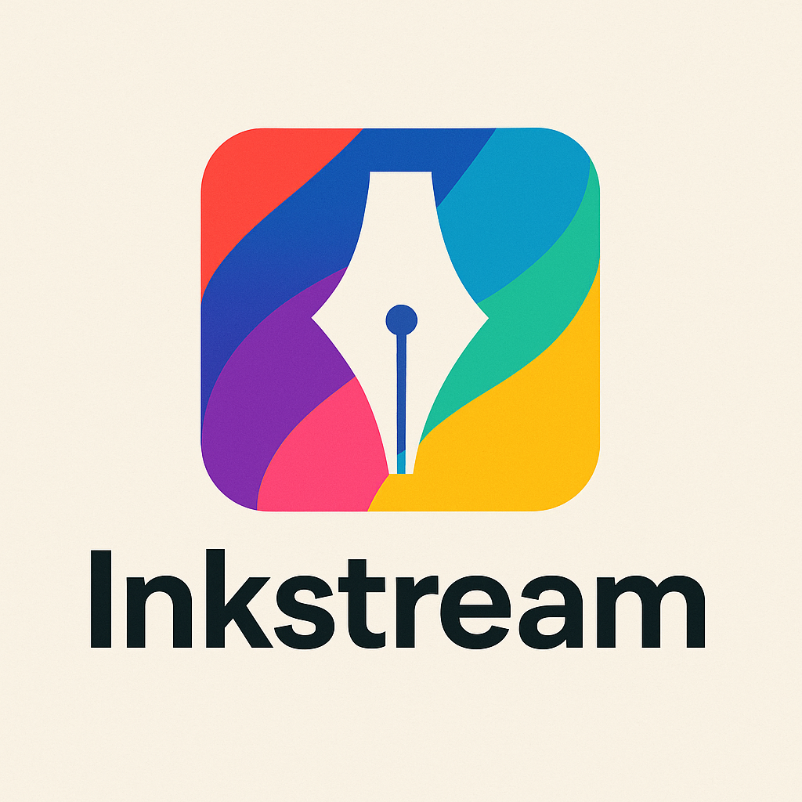

# Inkstream

<p align="center">
  
</p>

<p align="center">
  <a href="https://aws.amazon.com/">
    
  </a>
  <a href="https://react.dev/">
    
  </a>
  <a href="https://vitejs.dev/">
    
  </a>
  <a href="https://tailwindcss.com/">
    
  </a>
</p>

---

**Inkstream** is a modern, full-stack serverless web application built on AWS, designed for seamless document processing and language transformation. Users can upload images or PDFs through a comprehensive React dashboard, which are then automatically processed through a robust, AI-powered workflow with real-time progress tracking.

## ✨ What Does Inkstream Do?

1. **Upload**: Users upload images or PDFs via a modern React dashboard with drag-and-drop support
2. **Real-time Tracking**: Live workflow progress tracking with 5-second polling and status updates
3. **Text Extraction**: Documents are processed using **Amazon Textract** to extract text
4. **AI Reformat & Translation**: The extracted text is sent to **Anthropic Claude 3 Haiku** on **Amazon Bedrock** for reformatting and/or translation to 20+ supported languages
5. **Text-to-Speech (Optional)**: The processed text can be converted to speech using **Amazon Polly**
6. **Download Management**: Progressive file downloads as workflow steps complete, with download buttons and progress indicators
7. **Storage & Tracking**: All files and metadata are securely stored in **Amazon S3** and **DynamoDB**
8. **Authentication**: Secure sign-in with **Amazon Cognito** (federated with Google OAuth)
9. **Workflow Orchestration**: All backend processing is orchestrated using **AWS Step Functions** and **AWS Lambda**

---

## 🛠️ Technologies Used

### Frontend Stack
- **React** ^18.2.0 with **TypeScript** ~5.8.3
- **Vite** ^6.3.5 for build tooling and development
- **Tailwind CSS** ^4.1.7 for styling
- **Radix UI** components with **shadcn/ui** design system
- **TanStack Query** ^5.79.0 for server state management
- **React Hook Form** + **Zod** for form validation
- **AWS Amplify** ^6.14.4 for AWS service integration
- **Next Themes** for dark mode support

### Backend & Infrastructure
- **Monorepo**: npm workspaces for code sharing and scalable development
- **API Gateway**: Serverless HTTP endpoints
- **AWS Lambda**: Stateless compute for all backend logic
- **AWS Step Functions**: Workflow orchestration
- **Amazon Textract**: OCR for text extraction
- **Amazon Bedrock**: LLM-powered text reformatting/translation (Claude 3 Haiku)
- **Amazon Polly**: Text-to-speech conversion
- **Amazon S3**: File storage and downloads
- **Amazon DynamoDB**: User and workflow metadata
- **Amazon Cognito**: Authentication (with Google OAuth federation)
- **AWS CDK**: Infrastructure as code (TypeScript)

---

## 📦 Monorepo Structure

- `apps/frontend/` – React frontend application
  - Modern React ^18.2.0 with TypeScript
  - Vite ^6.3.5 for development and building
  - Tailwind CSS ^4.1.7 + Radix UI components
  - Comprehensive workflow management dashboard
  - Real-time updates, dark mode, mobile responsive
- `packages/aws-cdk-infra/` – AWS CDK infrastructure
  - Step Functions workflow orchestration
  - Lambda functions for processing
  - API Gateway for HTTP endpoints
  - S3, DynamoDB, Cognito, Textract, Bedrock, Polly
- `packages/` – Shared packages (if any)

---

## 🚀 Quick Start

This project uses npm workspaces. Commands are typically run from the root of the monorepo.

1. **Install all dependencies:** (From the project root, this installs dependencies for all workspaces)

   ```sh
   npm install
   ```

2. **Run the frontend app:** (Starts the Vite development server for `apps/frontend`)

   ```sh
   npm run dev:frontend
   ```

3. **Deploy the AWS CDK infrastructure:** (Deploys AWS resources defined in `packages/aws-cdk-infra`)

   ```sh
   npm run deploy:infra:dev
   ```

   *Note: Replace `:dev` with your target environment (`:prod`, `:staging`, etc.). You can also use CDK commands directly within the `packages/aws-cdk-infra` directory.*

---

## 🚀 Production Deployment

### Frontend (React App)
The React application can be deployed to any static hosting service:

1. **Build the frontend**:
   ```sh
   npm run build:frontend
   ```

2. **Deploy** the `apps/frontend/dist/` folder to your hosting provider (AWS S3, Vercel, Netlify, etc.)

### Backend (AWS Infrastructure)
Deploy the complete AWS infrastructure:

```sh
# Production deployment
npm run deploy:infra:prod  # or your production environment
```

## Working with AWS CDK Infrastructure

The AWS CDK infrastructure code is in `packages/aws-cdk-infra/`. While root-level scripts like `npm run deploy:infra:dev` are recommended for common tasks, you can run specific CDK commands directly:

```sh
cd packages/aws-cdk-infra
npm install # Usually not needed if root `npm install` was run
# Replace <command> with any CDK command, e.g., synth, diff, bootstrap, deploy, etc.
npx cdk <command> # e.g., npx cdk deploy, npx cdk synth
```

---

## 🎯 Key Features

### Frontend Dashboard
- **🔐 Authentication**: Secure Google OAuth integration via AWS Cognito
- **📊 Real-time Tracking**: Live workflow progress 
- **📱 Responsive Design**: Mobile-optimized interface with dark mode support
- **📄 File Management**: Drag-and-drop upload with validation (PDF, JPG, JPEG, PNG)
- **⬇️ Progressive Downloads**: Download files as workflow steps complete
- **🌐 Multi-language**: Support for 20+ languages for translation
- **🎨 Modern UI**: Built with Radix UI components and Tailwind CSS

### Backend Processing
- **🔄 Workflow Orchestration**: AWS Step Functions manage the entire process
- **📝 Text Extraction**: Amazon Textract for OCR
- **🤖 AI Processing**: OpenAI gpt-4o or Claude 3 Haiku on Bedrock for formatting and translation
- **🔊 Text-to-Speech**: Amazon Polly for audio generation
- **☁️ Serverless**: Fully serverless architecture
- **🗄️ Data Management**: DynamoDB for metadata, S3 for file storage

---

## 📋 Prerequisites

Before running this project, ensure you have:

- **Node.js** 18+ and **npm**
- **AWS CLI** configured with appropriate permissions
- **AWS CDK** installed globally: `npm install -g aws-cdk`
- **Git** for version control

---

## 🏗️ Development Setup

### 1. Clone and Install
```sh
git clone <repository-url>
cd inkstream
npm install
```

### 2. Frontend Development
```sh
# Start development server
npm run dev:frontend

# Build for production
npm run build:frontend

# Run linting
cd apps/frontend && npm run lint
```

### 3. Infrastructure Deployment
```sh
# Bootstrap CDK (first time only)
cd packages/aws-cdk-infra
npx cdk bootstrap

# Deploy to development environment
npm run deploy:infra:dev

# View changes before deployment
npx cdk diff
```
